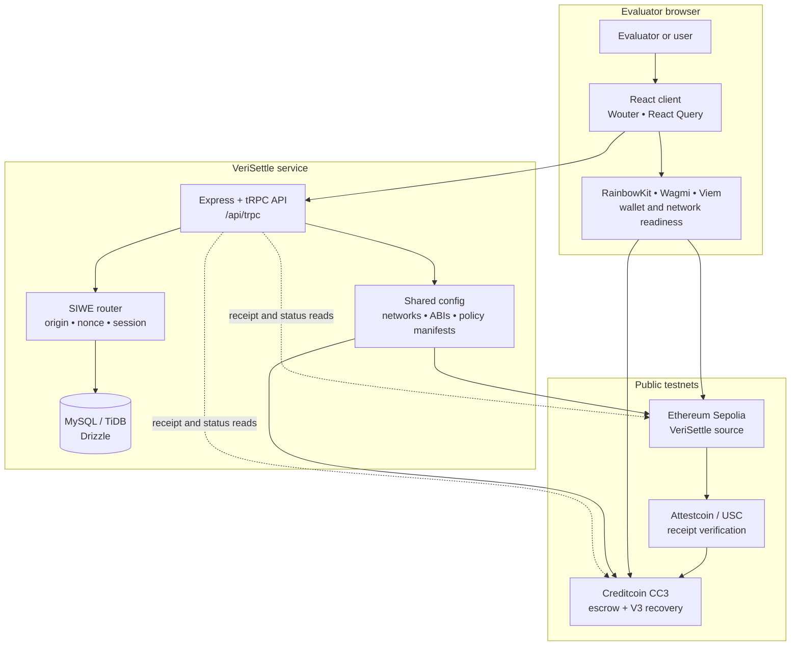

# VeriSettle

**Attestcoin verifies the acceptance receipt, NOT physical delivery.**

**VeriSettle** is a receipt-bound, cross-chain escrow prototype for **BUIDL CTC Fall 2026**. A buyer locks test tCTC on Creditcoin CC3; after the buyer accepts an order on Ethereum Sepolia, Attestcoin verification binds that receipt to the agreed terms and releases the escrow once.

> **Testnet only.** VeriSettle uses real public testnet contracts and transactions. It does **not** custody real customer funds, verify physical delivery, or operate as a production settlement service. Public hostnames: **https://verisettle.vercel.app** and **https://verisettle.vercel.app/judge**. Source: https://github.com/anhquan075/verisettle.

## Evaluate the live project

| Entry point | What it shows |
|---|---|
| [Launch VeriSettle](https://verisettle.vercel.app) | Canonical product URL. Landing page and workspace entry. |
| [Open Judge Evidence](https://verisettle.vercel.app/judge) | Featured **two-wallet** (buyer ≠ seller) fund → accept → release, then the historical self-deal run, replay boundary, and V3 recovery. |
| [Fund `0x804d…f372`](https://creditcoin-testnet.blockscout.com/tx/0x804d1c2675a2ae747947961685b910db8276b1643df42bd9a299c5fdabbef372) | Live V1 CC3 funding. Buyer `0xABe59F75…523A3` locked 0.1 tCTC. |
| [Accept `0x7197…b46a`](https://sepolia.etherscan.io/tx/0x71970aa7dfd99754ceb2b4ce73b6a874072325f57c9af7aed9bdf24b1b31b46a) | Live Sepolia `OrderAccepted` (block 11689016). |
| [Release `0x100f…8a97`](https://creditcoin-testnet.blockscout.com/tx/0x100f44bf75709e2395645cb6e348c101dde5f3c6cafde21c50bd5fb89a7a8a97) | Live V1 CC3 Attestcoin release (block 5475123). Replay: `QueryAlreadyProcessed`. |
| [V2 fund `0xe104…c512`](https://creditcoin-testnet.blockscout.com/tx/0xe104db9bb173c702662af216b58b7eaad93e1e6dacb2c582bb496533f753c512) | Live two-wallet V2 funding (0.1 tCTC, buyer ≠ seller). |
| [V2 accept `0x771d…b381`](https://sepolia.etherscan.io/tx/0x771d35f76ca3dba527c649f065ff63f84e6dc1f2eec80b26c320a15440ffb381) | Live Sepolia `OrderAcceptedV2` (block 11689062). |
| [V2 release `0xd3b4…da62`](https://creditcoin-testnet.blockscout.com/tx/0xd3b47603f9948352199f5532a3967fff0875e2daf6c8eb2f4e46a5e4f33cda62) | Live `EscrowReleasedV2` (CC3 5475166). Replay: `QueryAlreadyProcessed`. |
| [Public evidence markdown](docs/PUBLIC_EVIDENCE.md) | PDF-friendly receipt index. Live two-wallet JSON: `contracts/test-runs/two-wallet-f0a16e83.json` and `contracts/test-runs/v2-two-wallet-38e0f2e2.json`. |
| [DoraHacks paste copy](docs/DORA_COPY.md) | Project Description + Attestcoin Integration Summary. |
| [Enhancement proposal](docs/ENHANCEMENT_PROPOSAL.md) | P0 / P1 / P2 checklist for this scout-depth lift. |
| [CEIP PO pilot](docs/CEIP_PO_PILOT.md) | Purchase-order settlement one-pager. |
| [Browse the source repository](https://github.com/anhquan075/verisettle) | Public source, tests, contracts, scripts, and worker. |

## Settlement flow

| Step | Action | Enforced boundary |
|---|---|---|
| **1. Fund** | The buyer locks native test tCTC in a Creditcoin CC3 escrow. | The application recognizes funding only from a matching on-chain receipt. |
| **2. Accept** | The buyer emits `OrderAccepted` on Ethereum Sepolia. | The event is bound to buyer, seller, order identifier, and terms hash. |
| **3. Verify** | Attestcoin verifies the Sepolia receipt for the settlement path. | Receipt success, source event data, terms, parties, and one-time proof use are checked. |
| **4. Release once** | The verified proof unlocks the CC3 escrow. | A consumed query cannot release the same escrow again. |
| **5. Govern recovery** | V3 isolates dispute authority in a 2-of-3 multisig. | One signer cannot independently release or refund escrow. |

## High-level architecture



The browser owns wallet connection, signing, and chain selection. The server owns application sessions, nonce consumption, persisted deal state, and one-time testnet-funding eligibility. The on-chain path remains the authority for escrow, receipt verification, replay prevention, and governed recovery.

| Repository area | Responsibility |
|---|---|
| [`client/src/`](https://github.com/anhquan075/verisettle/tree/main/client/src) | React routes, public Judge Evidence, workspace, and interface components. |
| [`client/src/lib/wagmi.ts`](https://github.com/anhquan075/verisettle/blob/main/client/src/lib/wagmi.ts) | CC3/Sepolia network definition and RainbowKit/Wagmi configuration. |
| [`client/src/hooks/useWalletAccess.ts`](https://github.com/anhquan075/verisettle/blob/main/client/src/hooks/useWalletAccess.ts) | Connector discovery, network readiness, SIWE signing boundary, and switch feedback. |
| [`server/routers.ts`](https://github.com/anhquan075/verisettle/blob/main/server/routers.ts) | Composed tRPC API: deals, wallet authentication, and testnet funding. |
| [`server/routers/walletAuth.ts`](https://github.com/anhquan075/verisettle/blob/main/server/routers/walletAuth.ts) | Server-derived origin, one-time SIWE nonce, wallet linking, and session issuance. |
| [`drizzle/schema.ts`](https://github.com/anhquan075/verisettle/blob/main/drizzle/schema.ts) | Users, wallet identities, nonces, funding requests, deals, and receipt events. |
| [`contracts/`](https://github.com/anhquan075/verisettle/tree/main/contracts) | Solidity source for escrow policies and V3 governed recovery. |
| [`shared/v2PolicyManifest.ts`](https://github.com/anhquan075/verisettle/blob/main/shared/v2PolicyManifest.ts) | Deployed-policy addresses, ABI fragments, and code-hash manifest data. |

## Deployed testnet contracts

| Network | Contract | Explorer | Status |
|---|---|---|---|
| Ethereum Sepolia | VeriSettle source V1 | [`0x1aC5b6…17425`](https://sepolia.etherscan.io/address/0x1aC5b6B47EFe751681A206Fa8A5C305250017425) | Pending Etherscan (see `docs/VERIFY_CONTRACTS.md`) |
| Ethereum Sepolia | VeriSettle source V2 | [`0x56e6d3…0aa18`](https://sepolia.etherscan.io/address/0x56e6d3E213141AA8285D0b12504bDa5dA260aa18) | Pending Etherscan (see `docs/VERIFY_CONTRACTS.md`) |
| Creditcoin CC3 | V1 escrow ASC | [`0xe3565A…4736F`](https://creditcoin-testnet.blockscout.com/address/0xe3565A1A1B947f363ab433889522267cE3D4736F?tab=contract) | Verified |
| Creditcoin CC3 | V2 escrow ASC | [`0x185c81…D641`](https://creditcoin-testnet.blockscout.com/address/0x185c81ED5a757d1e290BaBa55F051f3cE791D641?tab=contract) | Verified |
| Creditcoin CC3 | V3 dispute multisig | [`0x0C9b8e…e2849`](https://creditcoin-testnet.blockscout.com/address/0x0C9b8ef45Aa36922bb3dde9AEec1BB1bAFce2849?tab=contract) | Verified |
| Creditcoin CC3 | V3 governed escrow | [`0x5eB2b5…01bc7`](https://creditcoin-testnet.blockscout.com/address/0x5eB2b5d2B659f6fb434F1D4d26F3d41773201bc7?tab=contract) | Verified |

Attempt log: [`contracts/deployments/verification-attempt.json`](contracts/deployments/verification-attempt.json).

## Security and testnet boundaries

VeriSettle uses a wallet signature for **SIWE authentication only**; it does not authorize a transfer. The server derives the approved origin, issues a short-lived one-time nonce, consumes that nonce on verification, and creates the session after a valid signature. Testnet funding has separate user confirmation and is constrained by wallet and user identity. Ordinary settlement is receipt-bound and replay-protected; V3 moves recovery authority into a distinct 2-of-3 multisig.

The contract and SDK integration follows the Attestcoin smart-contract and USC SDK documentation.[1] [2]

## Run locally

Install dependencies, configure required server variables in a local untracked `.env` file, then start development:

```bash
pnpm install
pnpm dev
```

Run the normal validation gates before opening a pull request:

```bash
pnpm test           # application regression suite
pnpm check          # TypeScript validation
pnpm test:contracts # Foundry tests (V2 invariants, multisig, optional carrier + silence)
pnpm build          # production build
```

### Evidence and verification

```bash
pnpm evidence:two-wallet     # buyer key ≠ seller key; writes contracts/test-runs/
pnpm evidence:two-wallet:v2
pnpm evidence:v2             # EscrowReleasedV2 + negative PolicyMismatch / expired acceptance
pnpm verify:contracts        # Blockscout without a key; Sepolia only when ETHERSCAN_API_KEY is set
```

If keys are absent, the evidence scripts exit and leave filled templates. See `contracts/test-runs/RUNBOOK.md` and `docs/VERIFY_CONTRACTS.md`.

### Optional offchain worker

A thin relayer watches Sepolia `OrderAccepted` / `OrderAcceptedV2` for funded orders, waits on ChainInfo `0xFD3`, builds a `ProofBuilder` proof, and calls `submitAcceptanceProof`. **The relayer cannot steal escrow** — ASC party and terms checks remain authoritative. Manual wallet submit stays permissionless.

```bash
node worker/relayer.mjs --dry-run
RELAYER_PRIVATE_KEY=0x… pnpm worker:relayer
```

Details: `worker/README.md`.

### Optional policies (not the live default)

`VeriSettleCarrierSource` + `VeriSettleEscrowASCV2Optional` add a registered-carrier `DeliveryConfirmed` release path and a ChainInfo-clock silence refund (buyer or V3-style multisig). Buyer-accept V1/V2 deployments stay unchanged. Foundry coverage is in `test/foundry/V2OptionalPolicy.t.sol`.

Do **not** commit a private key, seed phrase, database URL, JWT secret, WalletConnect ID, or any environment file. The testnet funding signer is configured only in the deployment environment.

## References

[1]: https://docs.creditcoin.org/attestcoin-protocol/dapp-builder-infrastructure/attestcoin-smart-contracts.md "Attestcoin smart contracts"
[2]: https://docs.creditcoin.org/attestcoin-protocol/dapp-builder-infrastructure/attestcoin-sdk-usc-sdk.md "Attestcoin USC SDK"
