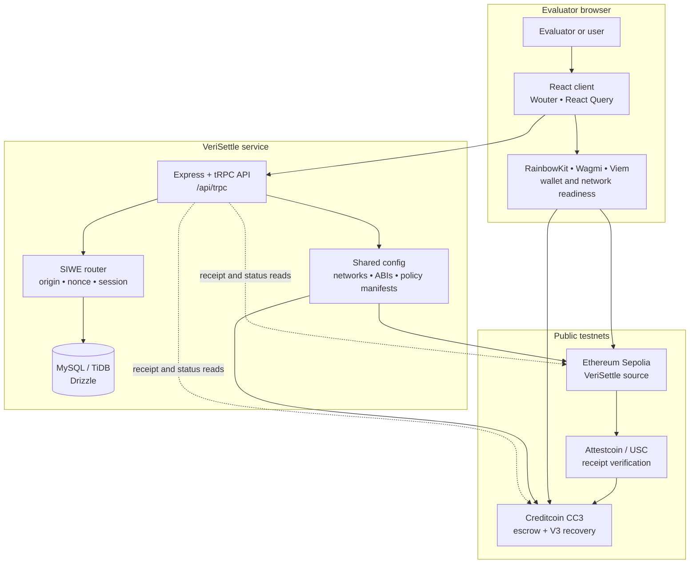

# VeriSettle

**VeriSettle** is a receipt-bound, cross-chain escrow prototype for **BUIDL CTC Fall 2026**. A buyer locks test tCTC on Creditcoin CC3; after the buyer accepts an order on Ethereum Sepolia, Attestcoin verification binds that receipt to the agreed terms and releases the escrow once.

> **Testnet only.** VeriSettle uses real public testnet contracts and transactions. It does **not** custody real customer funds, verify physical delivery, or operate as a production settlement service.

## Evaluate the live project

| Entry point | What it shows |
|---|---|
| [Launch VeriSettle](https://verisettle.vercel.app) | The public product landing page and workspace entry. |
| [Open Judge Evidence](https://verisettle.vercel.app/judge) | No-wallet receipt rail, replay boundary, deployed-contract links, and governed-recovery explanation. |
| [Watch the interactive Full HD walkthrough](https://files.manuscdn.com/user_upload_by_module/session_file/119889830/KogIzpIAXyJnCsjH.mp4) | A 1920 × 1080 real-interface walkthrough with public-route cursor interactions. |
| [Read the public evidence PDF](https://files.manuscdn.com/user_upload_by_module/session_file/119889830/oFbvQGsZNumWBoJA.pdf) | Submission-ready receipt and deployment evidence. |
| [Browse the source repository](https://github.com/anhquan075/verisettle) | Public source, tests, contracts, and build configuration. |

## Settlement flow

| Step | Action | Enforced boundary |
|---|---|---|
| **1. Fund** | The buyer locks native test tCTC in a Creditcoin CC3 escrow. | The application recognizes funding only from a matching on-chain receipt. |
| **2. Accept** | The buyer emits `OrderAccepted` on Ethereum Sepolia. | The event is bound to buyer, seller, order identifier, and terms hash. |
| **3. Verify** | Attestcoin verifies the Sepolia receipt for the settlement path. | Receipt success, source event data, terms, parties, and one-time proof use are checked. |
| **4. Release once** | The verified proof unlocks the CC3 escrow. | A consumed query cannot release the same escrow again. |
| **5. Govern recovery** | V3 isolates dispute authority in a 2-of-3 multisig. | One signer cannot independently release or refund escrow. |

## High-level architecture



The browser owns wallet connection, signing, and chain selection. The server owns application sessions, nonce consumption, persisted deal state, and one-time testnet-funding eligibility. The on-chain path remains the authority for escrow, receipt verification, replay prevention, and governed recovery.

| Repository area | Responsibility |
|---|---|
| [`client/src/`](https://github.com/anhquan075/verisettle/tree/main/client/src) | React routes, public Judge Evidence, workspace, and interface components. |
| [`client/src/lib/wagmi.ts`](https://github.com/anhquan075/verisettle/blob/main/client/src/lib/wagmi.ts) | CC3/Sepolia network definition and RainbowKit/Wagmi configuration. |
| [`client/src/hooks/useWalletAccess.ts`](https://github.com/anhquan075/verisettle/blob/main/client/src/hooks/useWalletAccess.ts) | Connector discovery, network readiness, SIWE signing boundary, and switch feedback. |
| [`server/routers.ts`](https://github.com/anhquan075/verisettle/blob/main/server/routers.ts) | Composed tRPC API: deals, wallet authentication, and testnet funding. |
| [`server/routers/walletAuth.ts`](https://github.com/anhquan075/verisettle/blob/main/server/routers/walletAuth.ts) | Server-derived origin, one-time SIWE nonce, wallet linking, and session issuance. |
| [`drizzle/schema.ts`](https://github.com/anhquan075/verisettle/blob/main/drizzle/schema.ts) | Users, wallet identities, nonces, funding requests, deals, and receipt events. |
| [`contracts/`](https://github.com/anhquan075/verisettle/tree/main/contracts) | Solidity source for escrow policies and V3 governed recovery. |
| [`shared/v2PolicyManifest.ts`](https://github.com/anhquan075/verisettle/blob/main/shared/v2PolicyManifest.ts) | Deployed-policy addresses, ABI fragments, and code-hash manifest data. |

## Deployed testnet contracts

| Network | Contract | Public deployment |
|---|---|---|
| Ethereum Sepolia | [VeriSettle source V1](https://sepolia.etherscan.io/address/0x1aC5b6B47EFe751681A206Fa8A5C305250017425) | `0x1aC5b6B47EFe751681A206Fa8A5C305250017425` |
| Ethereum Sepolia | [VeriSettle source V2](https://sepolia.etherscan.io/address/0x56e6d3E213141AA8285D0b12504bDa5dA260aa18) | `0x56e6d3E213141AA8285D0b12504bDa5dA260aa18` |
| Creditcoin CC3 | [V2 escrow ASC](https://creditcoin-testnet.blockscout.com/address/0x185c81ED5a757d1e290BaBa55F051f3cE791D641) | `0x185c81ED5a757d1e290BaBa55F051f3cE791D641` |
| Creditcoin CC3 | [V3 dispute multisig](https://creditcoin-testnet.blockscout.com/address/0x0C9b8ef45Aa36922bb3dde9AEec1BB1bAFce2849) | `0x0C9b8ef45Aa36922bb3dde9AEec1BB1bAFce2849` |
| Creditcoin CC3 | [V3 governed escrow](https://creditcoin-testnet.blockscout.com/address/0x5eB2b5d2B659f6fb434F1D4d26F3d41773201bc7) | `0x5eB2b5d2B659f6fb434F1D4d26F3d41773201bc7` |

## Security and testnet boundaries

VeriSettle uses a wallet signature for **SIWE authentication only**; it does not authorize a transfer. The server derives the approved origin, issues a short-lived one-time nonce, consumes that nonce on verification, and creates the session after a valid signature. Testnet funding has separate user confirmation and is constrained by wallet and user identity. Ordinary settlement is receipt-bound and replay-protected; V3 moves recovery authority into a distinct 2-of-3 multisig.

The contract and SDK integration follows the Attestcoin smart-contract and USC SDK documentation.[1] [2]

## Run locally

Install dependencies, configure required server variables in a local untracked `.env` file, then start development:

```bash
pnpm install
pnpm dev
```

Run the normal validation gates before opening a pull request:

```bash
pnpm test   # application regression suite
pnpm check  # TypeScript validation
pnpm build  # production build
```

Do **not** commit a private key, seed phrase, database URL, JWT secret, WalletConnect ID, or any environment file. The testnet funding signer is configured only in the deployment environment.

## References

[1]: https://docs.creditcoin.org/attestcoin-protocol/dapp-builder-infrastructure/attestcoin-smart-contracts.md "Attestcoin smart contracts"
[2]: https://docs.creditcoin.org/attestcoin-protocol/dapp-builder-infrastructure/attestcoin-sdk-usc-sdk.md "Attestcoin USC SDK"
